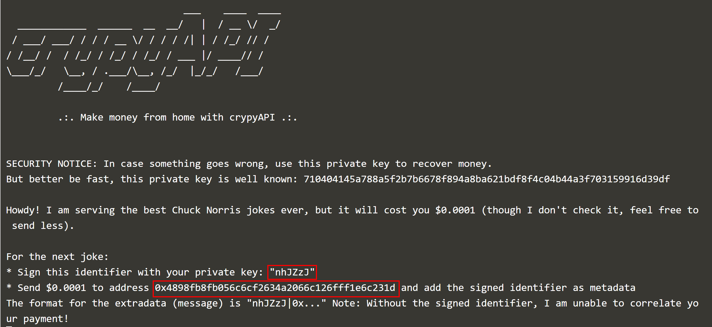
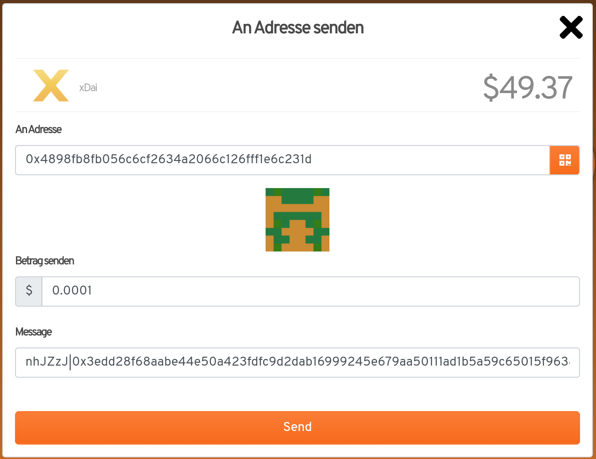
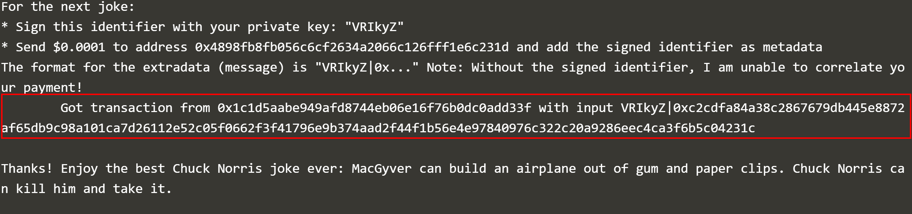

## Prerequisites

* Installed MetaMask, configured for xDai network id 100 with at least 0.01 XDAI balance

## Start Chuck Norris Joking Machine

* Download latest version of demo.

`curl -s https://api.github.com/repos/ice09/crypyapi-demo/releases/latest | grep "crypyapi-0.0.4.jar" | cut -d : -f 2,3| tr -d \" | wget -qi -`{{execute}}

* Start demo.

`java -jar crypyapi-0.0.4.jar`{{execute}}

* Note down the address and transaction identifier and create a transaction in Burnerwallet.

* Go to https://www.myetherwallet.com/interface/sign-message

* Send 0.0001 XDAI to the address with the signed transaction identifier

* Watch the best Chuck Norris joke ever after the payment could be successfully correlated to the request

That's it, you just paid a machine for a cheap joke, congratulations!

